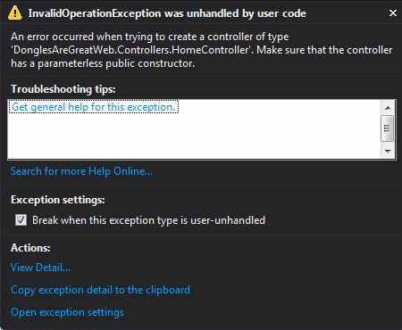

# 'Dongles Are Great' Solution Design
For brevity, I removed "DonglesAreGreat" in the following paragraphs.

The article is based on using Visual Studio 2013 and .NET 4.5.2.

__Core:__ The purpose is to only have stable or highly reliable dependencies. Mostly domain logic and interfaces for services that need to be provided via IoC.

__Infrastructure:__ Dependencies that are not tied to any UI specific implementation. Could include cross-cutting concerns. I'm being generic here but you would have more than one infrastructure project like "Infrastructure.EntityFramework" etc.

__Web:__ UI implementation for the Web.

## Dependency Build Issue #1

__Description:__ When building the solution, not all assemblies are being copied from referenced projects. 

__Example:__ The Web project is using Ninject for all of its Dependency Injection (Mvc included). Ninject offers other Nuget packages that have implementations for specific loggers. In this case, in the Infrastructure project,  you will see `Ninject.Extensions.Logging.nlog2` being referenced. Ninject is exposing its own `ILogger` but is actually using nLog2 to do the logging.

You will notice that there is a class named `IClassLoggingService` which implements `Ninject.Extensions.Logger.ILogger`, see below:

    namespace DonglesAreGreat.Infrastructure
    {
        public class ClassLoggingService : IClassLoggingService, ILogger
        {
            private readonly ILogger _logger;

            public ClassLoggingService(Type targetType)
            {
                IKernel kernel = new StandardKernel();
                var loggerFactory = kernel.Get<ILoggerFactory>();
                _logger = loggerFactory.GetLogger(targetType);
            }
		    ...
        }
    }

Which is wired up via this:

	namespace DonglesAreGreat.Infrastructure
	{
	    public static class Registry
	    {
	        public static void RegisterServices(IKernel kernel)
	        {
	            
	            kernel.Bind<IClassLoggingService>()
	                .ToMethod(context => new ClassLoggingService(context.Request.Target.Member.DeclaringType));

	            kernel.Bind<IDongleRepository>().To<DongleRepository>();
	        }
	    }
	}

Which is called in `NinjectWebCommon.cs` via this:

    /// 

    /// Load your modules or register your services here!
    /// 

    /// <param name="kernel">The kernel.</param>
    private static void RegisterServices(IKernel kernel)
    {
        DonglesAreGreat.Infrastructure.Registry.RegisterServices(kernel);
    }   

Finally, if you build the solution and run the application in debug, you will get this:

__Simple Explanation:__ Ninject could not instantiate the `HomeController` because one of it's dependencies was never constructed.

`HomeController` snippet:

	namespace DonglesAreGreatWeb.Controllers
	{
	    public class HomeController : Controller
	    {
	        private IDongleRepository _dongleRepository;
	
	        public HomeController(IDongleRepository dongleRepository)
	        {
	            _dongleRepository = dongleRepository;
	        }
            ...
        }
    }

The dependency being, `IDongleRepository`

	namespace DonglesAreGreat.Infrastructure
	{
	    public class DongleRepository : IDongleRepository
	    {
	        private IClassLoggingService _loggingService;
	
	        public DongleRepository(IClassLoggingService loggingService)
	        {
	            _loggingService = loggingService;
	        }
	
	        public Dongle GetDongle()
	        {
	            _loggingService.Info("Getting the Dongle...");
	            var de = new DongleEntity();
	            var result = AutoMapper.Mapper.Map<Dongle>(de);
	            return result;
	        }
	    }
	}

Now we are making full circle. In order for `HomeController` to be registered with IoC, `IDongleRepository` needs to be registered, which also means `IClassLoggingService` needs to also be registered... and here is where the problem is. Observe the `bin` directories and you will quickly find out that `Ninject.Extensions.Logging.nlog2.dll` is missing in the Web `bin` directory.

If you simply copy `Ninject.Extensions.Logging.nlog2.dll` to the Web `bin` directory and run the application it will work.

__Better Explanation:__ Since IoC promotes loose coupling, here we have a case that Ninject is so loosely coupled, the .NET build system doesn't know that `Ninject.Extensions.Logging.nlog2.dll` is being used and tries to be efficient about only copying libraries that are being used. 

__Solution:__ At this point, I can only think of two alternatives, setup a build event to copy all the output from Infrastructure to Web output directory. Or, go ahead and add Nuget packages to the Web project that aren't being copied automatically. If you use Build events, keep in mind you are only copying files when the .NET build system detects it needs to do a build. So if you delete all the binaries out of the application `bin` folder but not the other referenced projects and no changes occurred in the referenced project, the build event will not fire even though you built your application project.

## Dependency Build Issue #2

__Description:__ The .NET build system does not always detect dependencies the same way with each build.

__Example:__ The Infrastructure project is using AutoMapper to map `DongleEntity` to `Dongle`. Observe that when you install AutoMapper for .NET, you will get `AutoMapper.dll` and `AutoMapper.Net4.dll`. If you do a **Clean** then **Build** on the entire solution, then look in the Web `bin` folder, you will notice that both `AutoMapper.dll` and `AutoMapper.Net4.dll` are present. Now if you do a **Build** on the solution, `AutoMapper.Net4.dll` will disappear but `AutoMapper.dll` stays.

__Some Explanation:__ It appears that `AutoMapper.dll` is designed with the oldest .NET frameworks in mind and `AutoMapper.Net4.dll` provides types that came later (.NET 4+). 

As for why the .NET build system behaves differently in a **Clean & Build** vs a **Build**, that has not been discovered.

Here is [another case of Automapper.Net4 issue](http://biilmann.dk/?p=97) and they simply used a build event to work around the problem.

